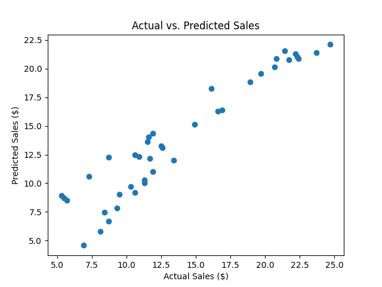

# Advertising Sales Prediction Using Simple Linear Regression

 This project aims to predict sales revenue based on advertising budgets for different channels, including TV, radio, and newspaper. Using simple linear regression model

## Overview

In today's highly competitive market, understanding the impact of advertising on sales is crucial for businesses to make informed decisions and optimize their marketing strategies. This project leverages machine learning techniques, specifically linear regression, to analyze historical advertising data and predict future sales revenue.

## Features

- **Data Preprocessing**: Clean and preprocess the advertising sales dataset to prepare it for modeling.
- **Model Building**: Implement linear regression models to predict sales revenue based on advertising budgets.
- **Model Evaluation**: Assess model performance using metrics such as Mean Squared Error (MSE) and R-squared.
- **Visualization**: Visualize actual versus predicted sales to gain insights into model accuracy and performance.

## Getting Started

To run the project locally, follow these steps:

1. Clone the repository:
```bash
git clone https://github.com/typhonshambo/advertising-sales-prediction.git
```

2. Navigate to the project directory:
```bash
cd advertising-sales-prediction
```

3. Install the required dependencies:
```bash
pip3 install -r requirements.txt
```

4. Run the main script:
```bash
python3 main.py
```


## Dataset

The project uses a publicly available dataset from [Kaggle](https://www.kaggle.com/datasets/yasserh/advertising-sales-dataset/data), containing advertising budgets for TV, radio, and newspaper ads, as well as sales revenue. The dataset can be found in the `data/` directory.

### Output of model


## Contributing

Contributions are welcome! If you have any ideas for improvements or new features, feel free to open an issue or submit a pull request.

## License

This project is licensed under the MIT License. See the [LICENSE](LICENSE) file for details.


